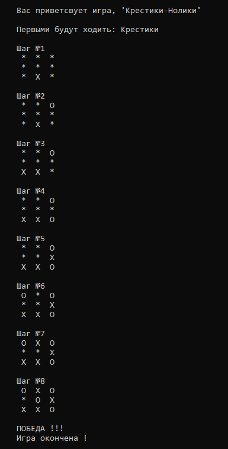
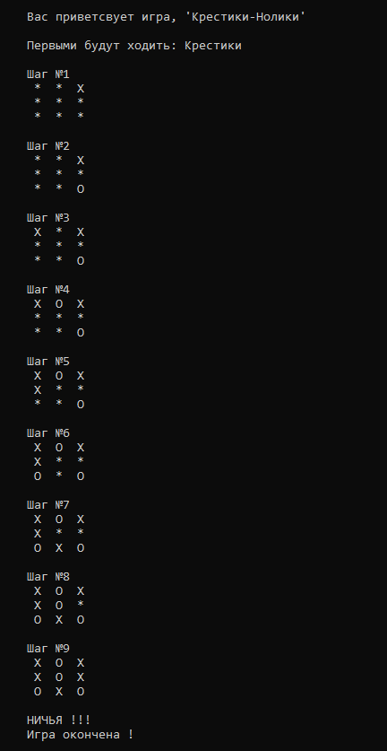

# Игра "Крестики-Нолики"

Консольная реализация классических крестиков-ноликов на TypeScript.

## Требования

- Установлена Node.js

## Установка

Клонируйте репозиторий:
```bash
git clone https://github.com/neronovtf/xo-game
cd xo-game
```

## Запуск
- Просто дважды кликните на start.bat (Windows)
- Или через консоль:
```bash
tsc
node dist/tictactoe.js
```

## Результат


